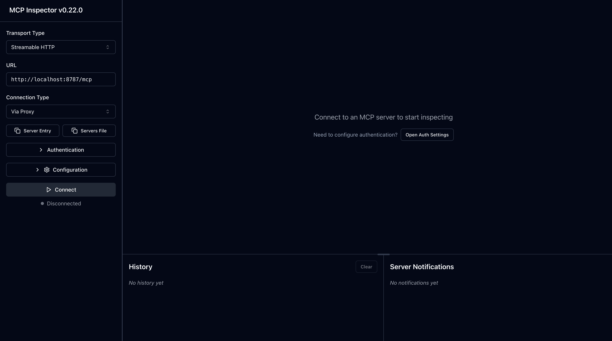

# Remote MCP Server with Descope Auth

Let's get a Remote MCP server up-and-running on Cloudflare Workers with Descope OAuth login!

> [!WARNING]
> This is a demo template designed to help you get started quickly. While we have implemented several security controls, **you must implement all preventive and defense-in-depth security measures before deploying to production**. Please review our comprehensive security guide: [Securing MCP Servers](https://github.com/cloudflare/agents/blob/main/docs/securing-mcp-servers.md)

## Prerequisites

Before you begin, ensure you have:

- A [Descope](https://www.descope.com/) account
- A Descope **Inbound App client** (created in the [Agentic Identity Hub → Clients](https://app.descope.com/) section — see below)
- Node.js version `18.x` or higher
- A Cloudflare account (for deployment)

## Develop locally

1. Create an Inbound App client in the Descope Console:
    - Go to **Agentic Identity Hub → Clients** and create a new client.
    - Allow Authorization code grant type.
    - Set the redirect / callback URL to `http://localhost:8787/callback` (add your deployed `https://<worker>.workers.dev/callback` too when you deploy).
    - From the client's **Connection Information**, copy the **Client ID** and **Client Secret** — these are the credentials this server uses to authorize against Descope.
    - **Define the scopes** the server requests (in the client's Scopes section). This server asks for `openid profile email`, so add:
        - `profile` → mapped to the `name` claim
        - `email` → mapped to the `email` claim
        - (`openid` is built-in and does not need to be added.)

    > Scopes requested at `/authorize` **must** be pre-defined on the Inbound App, or Descope rejects the request (`Received invalid scope`). The `openid` scope is required for the `/userinfo` call to succeed; `profile`/`email` populate the `name`/`email` claims returned by the `getUserInfo` tool.

2. Create a KV namespace for OAuth state storage:

```bash
npx wrangler kv namespace create OAUTH_KV
# Copy the ID and update wrangler.jsonc
```

3. Copy the `.dev.vars.example` file to `.dev.vars` and fill in your credentials:

```bash
# .dev.vars
DESCOPE_CLIENT_ID="your_inbound_app_client_id"
DESCOPE_CLIENT_SECRET="your_inbound_app_client_secret"
COOKIE_ENCRYPTION_KEY="your_cookie_encryption_key"
```

Generate the cookie encryption key:

```bash
openssl rand -hex 32
```

4. Clone and set up the repository:

```bash
# clone the repository
git clone git@github.com:cloudflare/ai.git

# install dependencies
cd ai
npm install

# run locally
npx nx dev remote-mcp-server-descope-auth
```

You should be able to open [`http://localhost:8787/`](http://localhost:8787/) in your browser

## Connect the MCP inspector to your server

To explore your new MCP api, you can use the [MCP Inspector](https://modelcontextprotocol.io/docs/tools/inspector).

1. Start it with `npx @modelcontextprotocol/inspector`
2. [Within the inspector](http://localhost:5173), set the Transport Type to `Streamable HTTP` and enter `http://localhost:8787/mcp` as the URL of the MCP server to connect to.
3. Click "Connect" (or run the **Quick OAuth Flow** from the Authentication panel). The inspector registers itself via Dynamic Client Registration, then redirects you to Descope to log in. This server is OAuth-protected — you do **not** paste a bearer token manually; the token is obtained through the OAuth flow.
4. After you authenticate, click "List Tools".
5. Run the "getUserInfo" tool to see your authenticated Descope profile, or "getToken" to see the Descope access token the server received.

<div align="center">
  
</div>


## Deploy to Cloudflare

1. Create a KV namespace for production:

```bash
npx wrangler kv namespace create OAUTH_KV
# Copy the returned ID into the production kv_namespaces binding in wrangler.jsonc
```

2. Set up your secrets in Cloudflare:

```bash
# Set Descope Inbound App credentials as secrets
npx wrangler secret put DESCOPE_CLIENT_ID
npx wrangler secret put DESCOPE_CLIENT_SECRET
npx wrangler secret put COOKIE_ENCRYPTION_KEY
```

> [!IMPORTANT]
> After deploying, add your production callback URL (`https://<worker>.workers.dev/callback`) to the Inbound App client's redirect URLs in **Agentic Identity Hub → Clients**.

3. Deploy the worker:

```bash
npm run deploy
```

## Call your newly deployed remote MCP server from a remote MCP client

Just like you did above in "Develop locally", run the MCP inspector:

```bash
npx @modelcontextprotocol/inspector@latest
```

Then, using the `Streamable HTTP` transport, enter the `workers.dev` URL (ex: `https://worker-name.account-name.workers.dev/mcp`) of your Worker in the inspector as the URL of the MCP server to connect to, and click "Connect".

You've now connected to your MCP server from a remote MCP client. Authentication runs through the Descope OAuth flow — no manual bearer token needed.


## Features

The MCP server implementation includes:

- 🔐 OAuth 2.0/2.1 Authorization Server Metadata (RFC 8414)
- 🔑 Dynamic Client Registration (RFC 7591)
- 🔒 PKCE Support
- 📝 Bearer Token Authentication
